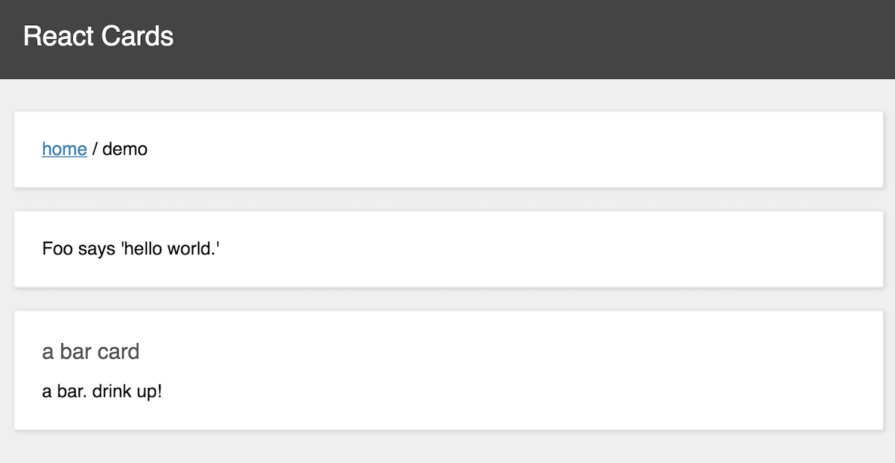

# React Cards

React Cards is inspired by Bruce Hauman's excellent [devcards](https://github.com/bhauman/devcards) project which aims to provide ClojureScript developers with a visual REPL-like experience especially suited for UI development.

React Cards tries to bring a similar experience to React developers,
opening up the possibility to quickly test
the look and feel as well as the behavior of a component.
Furthermore enabling developers to write markdown and
even run tests against the component, displaying the test results as a React component itself.

This approach has many benefits.
A component with multiple possible states can be difficult to test and document.
With React Cards we can display the component in many different states along with documentation and tests to ensure nothing breaks while we're working on the component.

### Getting started

Clone this repository and run

```javascript
npm install
npm run example
```

React Cards will be available at http://localhost:8080

To see React Cards in action, go to the example directory and start experimenting.

### Using React Cards in an existing project

Coming soon.

### Creating a static version of your React Cards

This is still work in progress. For now run
```javascript
npm run build:example
```

This will create a dist folder that includes index.html and app.js.  

## Writing Cards

```javascript
import React from 'react'
import cards from 'reactcards'
import {Foo, Bar} from './components'

const demo = cards('demo')

abc.card(<Foo message="yo" />, 'here is  a simple example')

demo.card(
  `## markdown doc
  you can use markdown for card documentation
  - foo
  - bar`,
  <Foo message="hello"/>
)

demo.card(<Foo message="hello world"/>)

demo.card(<Bar/>, {title: 'a bar card'})

```



#### Creating a stateful component

```javascript
import React from 'react'
import cards from 'reactcards'
import {StatefulComponent} from './components'

const demo = cards('demo')

demo.card(
  `## Counter

  This is a stateful counter. If you change the value prop
  in the source file it will not update because the new prop will be ignored
  and instead the component local state is rendered.

  Implement *componentWillReceiveProps* and override the component local state
  if you want this to work as expected.`,

  <StatefulCounter value={42}/>
)

```


#### Creating a stateful component with undo/redo


```javascript
import React from 'react'
import cards from 'reactcards'
import {StatefulComponent} from './components'

const demo = cards('demo')

demo.card(
  `## Undo/Redo
  Same example as before but with undo/redo controls added by the card.`,

  (state) =>
    <StatelessCounter
      value={state.get()}
      inc={() => state.update(x => x + 1)}
      dec={() => state.update(x => x - 1)}/>,
  {
    init: 1337,
    history:true,
  }
)

```


## Writing Tests

```javascript

// your test file...
import {assert} from 'chai'

export function testAdd() {
  assert.equal(1 + 1, 2)
}

export function testFail() {
  assert.isTrue(false)
}

// your reactcards file
import React from 'react'
import cards from 'reactcards'
import someTests from './testFile'

const demo = cards('demo')

demo.test(someTests, {title:'simple tests'})
```


You can write tests in a separate folder or write them directly inside a card. The first enables us to reuse the test
in a different setting. More information regarding testing very soon.


## Documentation

Coming Soon.


## License

Copyright © 2016 Ali Sharif, Stefan Oestreicher and contributors.

Distributed under the terms of the BSD-3-Clause license.
