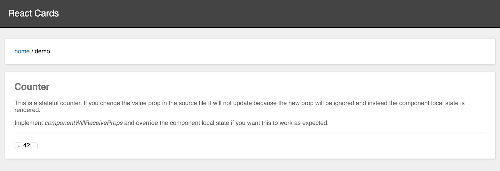

# React Cards

React Cards is inspired by Bruce Hauman's excellent [devcards](https://github.com/bhauman/devcards) project which aims to provide ClojureScript developers with a visual REPL-like experience especially suited for UI development.

### Getting Started

```javascript
npm install reactcards
```

Add an entry file (f.e. entry.js)

```javascript
import {run} from 'reactcards';
import './someCard';


if (module.hot) {
    module.hot.accept()
}

// off we go...
run();
```

Add reactcards to your package.json

```javascript
"scripts": {
   // ...
    "reactcards": "reactcards -p 8080 -e ./entry.js",
   // ...
}
```

Available options for reactcards 

```
-p, --port <number> Port to run React Card
-e, --entry <file> Entry point for React Cards
-c, --conf <file> Custom Webpack config file
```

Now you can simply run 

```javascript
npm run reactcards
```

React Cards will be available at http://localhost:8080

Also see the [create-react-app example project](https://github.com/steos/reactcards-example/tree/master/create-react-app-example)


### Using React Cards in an Existing Project

Coming soon.

### Creating a Static Version of Your React Cards

Coming soon.

## Writing Cards

```javascript
import React from 'react'
import cards from 'reactcards'
import {Foo, Bar} from './components'

const demo = cards('demo')

demo.card(
  `## markdown doc
  you can use markdown for card documentation
  - foo
  - bar`,
  <Foo message="hello"/>
)

demo.card(<Foo message="hello world"/>)

demo.card(<Bar/>, {title: 'a bar card'})

```


#### Creating a Stateful Component

```javascript
import React from 'react'
import cards from 'reactcards'
import {StatefulCounter} from './components'

const demo = cards('demo')

demo.card(
  `## Counter

  This is a stateful counter. If you change the value prop
  in the source file it will not update because the new prop will be ignored
  and instead the component local state is rendered.

  Implement *componentWillReceiveProps* and override the component local state
  if you want this to work as expected.`,

  <StatefulCounter value={42}/>
)

```



#### Displaying a Component With Undo/Redo


```javascript
import React from 'react'
import cards from 'reactcards'
import {StatelessCounter} from './components'

const demo = cards('demo')

demo.card(
  `## Undo/Redo
  Same example as before but with undo/redo controls added by the card.`,

  (state) =>
    <StatelessCounter
      value={state.get()}
      inc={() => state.update(x => x + 1)}
      dec={() => state.update(x => x - 1)}/>,
  {
    init: 1337,
    history:true,
  }
)

```


## Writing Tests

```javascript

// your test file...
import {assert} from 'chai'

export function testAdd() {
  assert.equal(1 + 1, 2)
}

export function testFail() {
  assert.isTrue(false)
}

// your reactcards file
import React from 'react'
import cards from 'reactcards'
import someTests from './testFile'

const demo = cards('demo')

demo.test(someTests, {title:'simple tests'})
```


You can write tests in a separate folder or write them directly inside a card. The first enables us to reuse the test
in a different setting. More information regarding testing very soon.


## Documentation

Work in progress.

## License

Copyright © 2016 Ali Sharif, Stefan Oestreicher and contributors.

Distributed under the terms of the BSD-3-Clause license.
